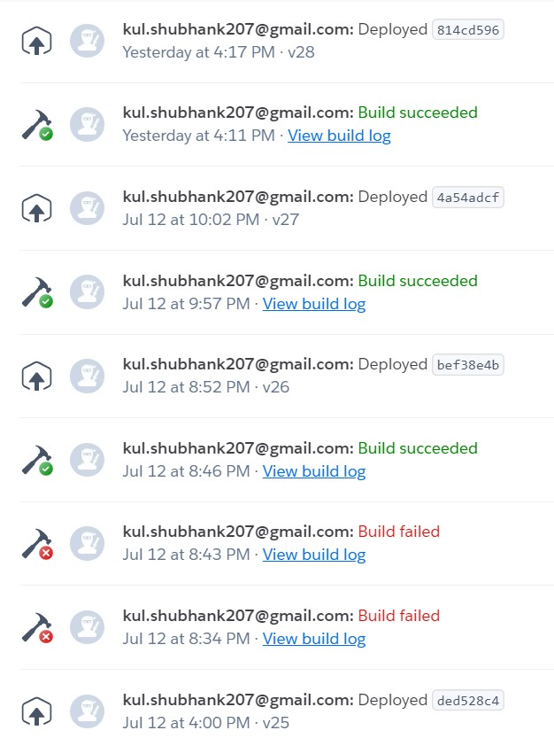

# Welcome to Shubs_Meet


# 
*A video chat app built from scratch without the use of any public or pre existing APIs/SDKs like firebase/jitsi*
<br />

Video link : [youtube](https://youtu.be/OFZAdckRr3I)<br />
Demo link : [shubh-meet](https://shubh-meet.herokuapp.com)

## Features
- Instantly create a new room or join a new one 💬
- Video call with multiple people in real-time 📹
- Mute audio/video 🙊
- Share screen during video call 💻
- Chat before starting a video call by creating a new room in conversations tab 😇
- Chat with your friends during a video call 😜
- View the chats that happened in the video meet before you even joined to catch up with others if u are late 🤙
- Chat notifications 📸 
- Continue your chat after the video call also ( includes your chats during the call ) 🤭
- Authentication support using passport and JWT tokens to prevent unknown users 🙌
- Simple and intuitive UI 😍
- XSS sanitization of chats (security 😉)
<br /> <br />

## TechStacks / Modules used
- ReactJS - (reactstrap , materailUI, etc)
- Redux
- Passport auth
- Express
- MongoDB
- SocketIO 
- WebRTC
- and others

<br /> 

## API endpoints
- /users (admin only)
- /users/login
- /users/signup
- /facebook/token (fb auth)
- /users/checkJWTToken
- /groups (to fetch groups of user)
- /groups/:roomId ( to fetch messages )

<br />

## Requirements
### To be able to run this app locally :
- you need to have Nodejs installed
- you need to have node package manager , npm or yarn( preferable )
- It currently uses a free and limited storage mongoDB cluster . To use local database or your database , change the mongoUrl in [config.js](config.js) . ( Use 'localhost:27017' for using local mongoDB and execute ```mongo run``` command on your terminal before using ) .
<br /><br />

## Installation / Local Setup

### **Running locally ( production server )**
#### `Step 1` - clone the repo
```bash
$ git clone https://github.com/5h0bh4nk/SHUBH_TEAMS_
```
#### `Step 2` - cd in the repo

```bash
$ cd SHUBH_TEAMS_
```
#### `Step 3` - install dependencies

```bash
$ yarn install
```
#### `Step 4` - Build the react app

```bash
$ yarn build
```
#### `Step 5` - run application

```bash
$ yarn start
```

In browser, open [http://localhost:4001](http://localhost:4001)

<br />

### **Running locally ( Development server )**
#### `Step 1` - clone the repo
```bash
$ git clone https://github.com/5h0bh4nk/SHUBH_TEAMS_
```
#### `Step 2` - cd in the repo

```bash
$ cd SHUBH_TEAMS_
```
#### `Step 3` - install dependencies

```bash
$ yarn install
```
#### `Step 4` - run application

```bash
$ yarn dev
```

In browser, open [http://localhost:8000](http://localhost:8000)

<br />

## Task sync strategies  
https://www.notion.so/998fad9b7fac42c8a2382d70e38f7263?v=645f6919cfcf4c6c918841b96ce22f75
<br />

## CI/CD of my app using heroku cli



<br />

## Code Structure

```bash
- 📂 __CODE STRUCTURE__
   - 📄 [Procfile](Procfile)
   - 📄 [README.md](README.md)
   - 📄 [app.js](app.js)
   - 📄 [authenticate.js](authenticate.js)
   - 📄 [config.js](config.js)
   - 📄 [list.md](list.md)
   - 📂 __models__
     - 📄 [groups.js](models/groups.js)
     - 📄 [message.js](models/message.js)
     - 📄 [user.js](models/user.js)
   - 📄 [node\_modules](node_modules)
   - 📄 [package.json](package.json)
   - 📂 __public__
     - 📄 [icon.png](public/icon.png)
     - 📄 [index.html](public/index.html)
     - 📄 [manifest.json](public/manifest.json)
     - 📄 [package.json](public/package.json)
     - 📄 [robots.txt](public/robots.txt)
   - 📂 __routes__
     - 📄 [cors.js](routes/cors.js)
     - 📄 [groupsRouter.js](routes/groupsRouter.js)
     - 📄 [index.js](routes/index.js)
     - 📄 [users.js](routes/users.js)
   - 📂 __src__
     - 📄 [App.js](src/App.js)
     - 📂 __Components__
       - 📂 __ContactBar__
         - 📄 [ContactBar.css](src/Components/ContactBar/ContactBar.css)
         - 📄 [ContactBar.js](src/Components/ContactBar/ContactBar.js)
       - 📂 __Header__
         - 📄 [Header.css](src/Components/Header/Header.css)
         - 📄 [Header.js](src/Components/Header/Header.js)
       - 📂 __Jumbotron__
         - 📄 [jumbotron.css](src/Components/Jumbotron/jumbotron.css)
         - 📄 [jumbotron.js](src/Components/Jumbotron/jumbotron.js)
       - 📂 __Navbar__
         - 📄 [Navbar.css](src/Components/Navbar/Navbar.css)
         - 📄 [Navbar.js](src/Components/Navbar/Navbar.js)
       - 📂 __SignButtons__
         - 📄 [SignButtons.css](src/Components/SignButtons/SignButtons.css)
         - 📄 [SignButtons.js](src/Components/SignButtons/SignButtons.js)
     - 📂 __Containers__
       - 📂 __Dashboard__
         - 📄 [Dashboard.css](src/Containers/Dashboard/Dashboard.css)
         - 📄 [Dashboard.js](src/Containers/Dashboard/Dashboard.js)
       - 📂 __Homepage__
         - 📄 [Homepage.css](src/Containers/Homepage/Homepage.css)
         - 📄 [Homepage.js](src/Containers/Homepage/Homepage.js)
       - 📂 __Login__
         - 📄 [Login.css](src/Containers/Login/Login.css)
         - 📄 [Login.js](src/Containers/Login/Login.js)
       - 📂 __MeetStart__
         - 📄 [Home.css](src/Containers/MeetStart/Home.css)
         - 📄 [Home.js](src/Containers/MeetStart/Home.js)
       - 📂 __Room__
         - 📂 __Helpers__
           - 📄 [peerConnectionConfig.js](src/Containers/Room/Helpers/peerConnectionConfig.js)
           - 📄 [server\_url.js](src/Containers/Room/Helpers/server_url.js)
         - 📄 [Video.css](src/Containers/Room/Video.css)
         - 📄 [Video.js](src/Containers/Room/Video.js)
       - 📂 __Signup__
         - 📄 [Signup.css](src/Containers/Signup/Signup.css)
         - 📄 [Signup.js](src/Containers/Signup/Signup.js)
     - 📂 __Messenger__
       - 📂 __App__
         - 📄 [App.test.js](src/Messenger/App/App.test.js)
         - 📄 [index.js](src/Messenger/App/index.js)
       - 📂 __Compose__
         - 📄 [Compose.css](src/Messenger/Compose/Compose.css)
         - 📄 [index.js](src/Messenger/Compose/index.js)
       - 📂 __ConversationList__
         - 📄 [ConversationList.css](src/Messenger/ConversationList/ConversationList.css)
         - 📄 [Dropdown.js](src/Messenger/ConversationList/Dropdown.js)
         - 📄 [index.js](src/Messenger/ConversationList/index.js)
       - 📂 __ConversationListItem__
         - 📄 [ConversationListItem.css](src/Messenger/ConversationListItem/ConversationListItem.css)
         - 📄 [index.js](src/Messenger/ConversationListItem/index.js)
       - 📂 __ConversationSearch__
         - 📄 [ConversationSearch.css](src/Messenger/ConversationSearch/ConversationSearch.css)
         - 📄 [index.js](src/Messenger/ConversationSearch/index.js)
       - 📂 __Message__
         - 📄 [Message.css](src/Messenger/Message/Message.css)
         - 📄 [index.js](src/Messenger/Message/index.js)
       - 📂 __MessageList__
         - 📄 [MessageList.css](src/Messenger/MessageList/MessageList.css)
         - 📄 [index.js](src/Messenger/MessageList/index.js)
       - 📂 __Messenger__
         - 📄 [Messenger.css](src/Messenger/Messenger/Messenger.css)
         - 📄 [index.js](src/Messenger/Messenger/index.js)
       - 📂 __Toolbar__
         - 📄 [Toolbar.css](src/Messenger/Toolbar/Toolbar.css)
         - 📄 [index.js](src/Messenger/Toolbar/index.js)
       - 📂 __ToolbarButton__
         - 📄 [ToolbarButton.css](src/Messenger/ToolbarButton/ToolbarButton.css)
         - 📄 [index.js](src/Messenger/ToolbarButton/index.js)
     - 📄 [index.js](src/index.js)
     - 📂 __redux__
       - 📄 [ActionCreators.js](src/redux/ActionCreators.js)
       - 📄 [ActionTypes.js](src/redux/ActionTypes.js)
       - 📄 [auth.js](src/redux/auth.js)
       - 📄 [configureStore.js](src/redux/configureStore.js)
       - 📄 [forms.js](src/redux/forms.js)
     - 📄 [serviceWorker.js](src/serviceWorker.js)
     - 📂 __shared__
       - 📄 [basUrl.js](src/shared/basUrl.js)
       - 📂 __images__
         - 📄 [demo.webp](src/shared/images/demo.webp)
         - 📄 [logo\-icon.png](src/shared/images/logo-icon.png)
         - 📄 [logo\-white.png](src/shared/images/logo-white.png)
         - 📄 [mslogo.svg](src/shared/images/mslogo.svg)
       - 📂 __storage__
         - 📄 [data.js](src/shared/storage/data.js)
   - 📄 [yarn.lock](yarn.lock)
```
